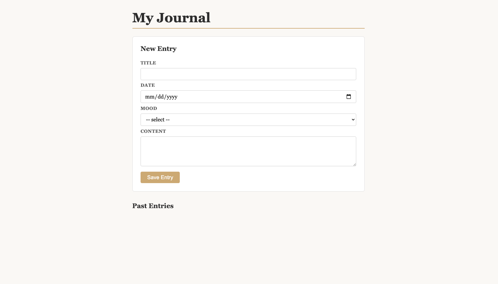

# Personal Journal App

**Table of Contents**
- [Assignment Overview](#assignment-overview)
  - [Set Up](#set-up)
  - [API Contract](#api-contract)
  - [Provided Frontend Code](#provided-frontend-code)
- [Tech Checklist (12 points + 1 bonus point)](#tech-checklist-12-points--1-bonus-point)
- [Task Hints](#task-hints)
  - [TODO 1 — Display each entry as a card](#todo-1--display-each-entry-as-a-card)
  - [TODO 2 — Fetch entries on load](#todo-2--fetch-entries-on-load)
  - [TODO 3 — Create an entry](#todo-3--create-an-entry)
  - [TODO 4 — Delete an entry](#todo-4--delete-an-entry)

## Assignment Overview

In this assignment you will build the **React frontend** for a pre-built Express + Postgres journal server. The server manages a collection of journal entries, each with a title, date, mood emoji, and content.

Your React app must:
- Fetch entries on load and display them
- Let users create and delete entries
- Use a `fetch-helpers.js` file to keep all API calls out of your components
- Follow the **refetch-after-write** pattern so the UI always reflects the real database state

You will not change any server code. Your work lives entirely in the `frontend/` directory.

### Set Up

For guidance on setting up and submitting this assignment, refer to the Marcy Lab School Docs How-To guide for [Working with Short Response and Coding Assignments](https://marcylabschool.gitbook.io/marcy-lab-school-docs/how-tos/working-with-assignments).

After cloning your repository, create a `draft` branch:

```sh
git checkout -b draft
```

**Set up the database:**

```sh
createdb journal_db
```

**Start the server** (in one terminal):

```sh
cd server
cp .env.template .env
npm i
node db/seed
npm run dev
```

**Start the frontend** (in a second terminal):

```sh
cd frontend
npm i
npm run dev
```

The server runs on port 8080 — the Vite proxy in `vite.config.js` is already configured to forward `/api` requests there, so you can write `fetch('/api/entries')` in your React code without worrying about ports.

Open [http://localhost:5173](http://localhost:5173) in your browser. You should see this:



### API Contract

The server provides the following endpoints:

| Method   | Endpoint           | Description     | Request Body                     |
| -------- | ------------------ | --------------- | -------------------------------- |
| `GET`    | `/api/entries`     | Get all entries | —                                |
| `POST`   | `/api/entries`     | Create an entry | `{ title, date, mood, content }` |
| `DELETE` | `/api/entries/:id` | Delete an entry | —                                |

An entry object looks like this:

```json
{
  "id": 1,
  "title": "First day of the bootcamp",
  "date": "2025-01-06",
  "mood": "😊",
  "content": "Met my cohort today. Everyone seems really kind and eager to learn."
}
```

Valid mood values: `😢`, `😠`, `😐`, `😊`, `😂`

### Provided Frontend Code

The application's component structure is already in place:

```
App
├── [entries, setEntries] state
├── EntryForm   ← renders a form to send a POST /api/entries request
└── EntryList   ← renders a list of EntryCard components
    └── EntryCard   ← renders a single EntryCard. A delete button can send a DELETE /api/entries/:entry_id request
```

However, only the basic JSX has been implemented. You will need to add the following functionality:
1. Pass down the entries state as props through the `EntryList` to render an `EntryCard` component for each entry.
2. Send a `GET /api/entries` request when the `App` loads to set the `entries` state to match the data in the database.
3. Send a `POST /api/entries` request when the form in `EntryForm` is submitted. This action should also cause the application to re-fetch entries.
4. Send a `DELETE /api/entries/:entry_id` request when an `EntryCard` component's "Delete" button is clicked. This action should also cause the application to re-fetch entries.

## Tech Checklist (12 points + 1 bonus point)

Your score is based on the number of completed requirements below. Aim for at least 75% (9/12) to complete the assignment.

**TODO 1 — Display entries** (3 points)
- [ ] `EntryList` maps over the `entries` data and renders one `EntryCard` per entry
- [ ] Each `EntryCard` displays the entry's `title`, `date`, `mood`, and `content`
- [ ] Each element in the list has a unique `key` prop

**TODO 2 — Fetch on load** (3 points)
- [ ] `fetchEntries` in `fetch-helpers.js` sends a `GET /api/entries` request and returns `{ data, error }`
- [ ] `loadEntries` in `App` calls `fetchEntries` and updates the `entries` state
- [ ] `loadEntries` is called once when `App` first "mounts" (the first time the component renders) using `useEffect`.

**TODO 3 — Create an entry** (3 points)
- [ ] `createEntry` in `fetch-helpers.js` sends a `POST /api/entries` request with the entry body and returns `{ data, error }`
- [ ] Submitting the form calls `createEntry` with `{ title, date, mood, content }` read from `form.elements`
- [ ] After a successful create, `loadEntries` is called to refetch the updated list

**TODO 4 — Delete an entry** (3 points)
- [ ] `deleteEntry` in `fetch-helpers.js` sends a `DELETE /api/entries/:id` request and returns `{ data, error }`
- [ ] Each `EntryCard` has a Delete button that calls `deleteEntry` with the entry's `id`
- [ ] After a successful delete, `loadEntries` is called to refetch the updated list

**Bonus** (1 points)
- [ ] Bonus: `fetch-helpers.js` uses a shared `handleFetch` helper to avoid repeating the try/catch and `{ data, error }` return pattern in every function

## Task Hints

Use the lecture code as your primary reference. The hints below show the equivalent patterns from the Todo app — adapt them for journal entries.

### TODO 1 — Display each entry as a card

`App` already has three default entries in state. Wire up `EntryList` and `EntryCard` to render them. You should see cards on screen without starting the server.

**Hint:** In the lecture code, `App` passes the `todos` state as a prop to `TodoList` (along with `loadTodos` as a second prop)

```jsx
<TodoList todos={todos} loadTodos={loadTodos} />
```

**Hint:** In the lecture code, `TodoList` maps over `todos` and renders a `TodoItem` for each one:

```jsx
const TodoList = ({ todos }) => (
  <ul>
    {todos.map((todo) => (
      <TodoItem key={todo.todo_id} todo={todo} />
    ))}
  </ul>
);
```

### TODO 2 — Fetch entries on load

Implement `fetchEntries` in `fetch-helpers.js` and use it to load real data from the server when `App` first mounts.

**Hint:** In the lecture code, `loadTodos` and `useEffect` work together like this:

```jsx
const loadTodos = async () => {
  const { data, error } = await fetchAllTodos();
  if (error) return console.error(error);
  setTodos(data);
};

useEffect(() => {
  loadTodos();
}, []);
```

**Check your work:** Start the server — the five seed entries should replace the three defaults after a brief moment.

### TODO 3 — Create an entry

Implement `createEntry` in `fetch-helpers.js` and use it in `EntryForm` to POST a new entry when the form is submitted. After a successful POST, refetch the list and reset the form.

**Hint:** Read field values from the form using `form.elements`, then follow the mutate → refetch pattern. Below is how this pattern is implemented in the `AddTodoForm` from the lecture code. Consider *"how can the `EntryForm` get access to the `loadTodos` function?"*

```jsx
const handleSubmit = async (e) => {
  e.preventDefault();
  const form = e.target;
  const title = form.elements.title.value;

  // Send the POST request
  const { error } = await createTodo(title);
  if (error) return console.error(error);
  
  // Refetch after the POST
  await loadTodos();
  form.reset();
};
```

**Check your work:** Submit the form — the new entry should appear in the list and the form should clear.

### TODO 4 — Delete an entry

Implement `deleteEntry` in `fetch-helpers.js` and add a Delete button to `EntryCard` that removes the entry and refetches the list.

**Hint:** Deleting follows the same mutate → refetch pattern as creating:

```jsx
const handleDelete = async () => {
  const { error } = await deleteTodo(todo_id);
  if (error) return console.error(error);
  loadTodos();
};
```

Think about how `loadEntries` needs to travel from `App` down to `EntryCard` to make this work.

**Check your work:** Click Delete on an entry — it should disappear from the list.
